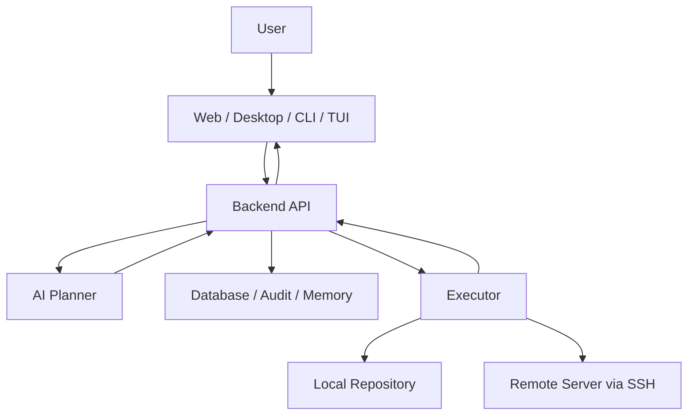

# ProjectPilot 创新软件设计方案

> GitHub 发布版草案

## 1. 项目定位

ProjectPilot 是一个面向个人开发者、小团队、实验室和多服务器项目场景的 **AI 项目状态管理与 Git 协作安全控制台**。

它不是普通的 Git GUI，也不是让 AI 自由敲命令的自动化脚本工具，而是把项目的代码状态、分支历史、运行环境、远程服务器、操作计划和团队经验放到同一个可解释系统里。

一句话概括：

```text
ProjectPilot 让开发者看懂项目当前在哪、改了什么、历史发生了什么、下一步怎样安全执行。
```

ProjectPilot 要解决的核心问题不是 Git 命令太多，而是开发者很难直观看清两个东西：

```text
状态：working tree / staged / committed / remote / server
历史：branch / commit / merge / rebase / reflog / operation log
```

因此，ProjectPilot 的创新重点是：

- 把 Git 的抽象状态变成可解释的项目状态图；
- 把危险操作变成可审批、可审计、可回退的执行计划；
- 把本地项目和多台服务器上的项目状态统一管理；
- 把团队踩过的坑沉淀为可搜索的项目记忆；
- 让 AI 扮演“分析和规划者”，Executor 扮演“受控执行者”。

## 2. 背景与痛点

普通开发者使用 Git 的困难通常不是不会输入某个命令，而是不知道当前状态意味着什么。

典型问题包括：

- 分支太多，不知道哪个还在用、哪个可以删；
- 不清楚本地分支和远程分支的 upstream 关系；
- 不知道改动现在处于 working tree、staged 还是 committed；
- commit 太碎、信息随意、PR 混入无关改动；
- 遇到 conflict 不知道 ours 和 theirs 分别代表谁；
- push 被拒绝后不知道该 pull、merge、rebase 还是放弃；
- 误 reset、误 commit、误 merge 后不知道 reflog 可以救；
- 害怕 force push，也不知道 `--force-with-lease` 的边界；
- GUI 能点出结果，但不理解背后执行了什么命令；
- 多台服务器上的项目分支、依赖、配置不一致，排查成本很高。

这些问题可以归纳为三个不透明：

```text
当前状态不透明
历史变化不透明
操作后果不透明
```

ProjectPilot 的设计目标就是消除这三个不透明。

## 3. 产品愿景

ProjectPilot 最终希望成为开发者项目目录旁边的“智能副驾驶面板”：

- 当用户打开一个项目，它能快速解释当前 Git 状态和运行环境；
- 当用户准备提交，它能帮助拆分改动、生成清晰 commit、阻止敏感文件；
- 当用户准备同步远程，它能解释 ahead、behind、diverged，并给出安全路径；
- 当用户遇到冲突，它能解释冲突来源、建议解决顺序，并提示后续命令；
- 当用户误操作，它能基于 reflog 和操作快照给出恢复方案；
- 当团队有多台服务器，它能对比每台机器的分支、提交、环境和配置差异；
- 当 AI 给出建议，它必须生成结构化计划，经过用户批准后才由 Executor 执行。

最终体验应该像这样：

```text
你当前在 main 分支。
本地有 3 个未暂存文件、2 个已暂存文件、1 个本地提交尚未推送。
远程 main 比你多 2 个提交，因此当前分支已经 diverged。

不建议直接 push。
建议先查看远程变化，然后选择：
1. merge 远程提交，保留完整协作历史；
2. rebase 本地未共享提交，整理线性历史；
3. 暂停同步，先拆分当前本地改动。

高风险操作不会自动执行。
```

## 4. 核心创新点

### 4.1 Git State Map：Git 状态四区图

ProjectPilot 将 Git 状态固定解释为四个区域：

```text
Working Tree -> Staged -> Local Commits -> Remote
```

每个文件、每个提交、每个远程差异都被映射到这四个区域中。

用户不需要先理解所有 Git 术语，也能看到：

- 哪些文件还没有暂存；
- 哪些文件已经暂存但还没有提交；
- 哪些提交只在本地；
- 远程是否领先、本地是否领先、双方是否分叉；
- 当前操作会把改动从哪个区域移动到哪个区域。

这是 ProjectPilot 和普通 Git GUI 的重要区别：它不只是显示命令结果，而是解释状态流向。

### 4.2 History Time Machine：Git 历史恢复中心

ProjectPilot 会把 `reflog`、HEAD、分支、暂存区和操作审计整合成恢复视图。

在高风险操作前，系统记录：

- 当前分支；
- 当前 HEAD；
- upstream；
- staged 文件列表；
- working tree 摘要；
- 最近 reflog；
- 即将执行的计划；
- 预计回退方式。

当用户误操作后，恢复中心可以给出场景化建议：

- 撤销刚刚的 commit；
- 回到 merge 前；
- 找回 reset 前的提交；
- 恢复误删分支；
- 从 reflog 找回丢失的提交；
- 判断是否可以安全 reset；
- 给出 soft、mixed、hard reset 的差异解释。

ProjectPilot 不把“回退”当作一个危险命令入口，而是把它做成可解释的恢复流程。

### 4.3 Safe Execution Protocol：安全执行协议

ProjectPilot 的 AI 不直接执行命令。

所有写操作必须经过以下链路：

```text
状态采集
  -> AI/规则生成操作计划
  -> 风险分级
  -> 用户批准
  -> Executor 执行
  -> 结果上传
  -> 审计记录
  -> 必要时生成恢复建议
```

执行计划必须包含：

- 操作类型；
- 目标路径；
- 目标分支或提交；
- 实际命令数组；
- 风险等级；
- 阻塞条件；
- 执行前快照；
- 失败处理方式；
- 可回退性说明。

ProjectPilot 不接受 AI 生成的自由 shell 文本直接执行。

### 4.4 Project Across Machines：跨机器项目状态图

很多团队不是只有一个本地仓库，而是同一个项目散落在多台服务器上：

```text
local-mac:    /Users/alice/work/project
dev-server:   /srv/project
gpu-server:   /data/project
prod-server:  /opt/project
```

ProjectPilot 将这些路径绑定为同一个 Project，并统一检测：

- Git 分支；
- commit；
- ahead / behind；
- dirty 状态；
- Python / Node.js / Docker / CUDA；
- 配置文件；
- 端口和磁盘；
- 最近操作；
- 服务器经验记录。

这样用户看到的不再是“某台机器上的仓库状态”，而是“同一个项目在所有机器上的状态矩阵”。

### 4.5 Team Memory：团队共享记忆

ProjectPilot 会把团队经验结构化保存：

- 某台服务器的特殊配置；
- 某个项目曾经出现过的问题；
- 某次部署失败的原因；
- 某个依赖版本不能升级；
- 某个共享目录不能删除；
- 某个 Git 操作造成过冲突；
- 某个恢复方案曾经成功。

之后 AI 分析问题时，可以结合这些记忆给出更贴近团队上下文的建议。

这让 ProjectPilot 从“工具”升级为“项目知识库的一部分”。

### 4.6 Explainable GUI / CLI：GUI 和命令行统一解释层

ProjectPilot 的 GUI、CLI、TUI 和后端 API 使用同一套操作计划模型。

用户在 GUI 点击按钮时，也能看到背后的命令计划：

```text
操作：同步远程
计划命令：
git fetch origin
git pull --ff-only

风险：低
阻塞条件：工作区必须干净，分支不能 diverged
```

用户在命令行看到 Git 报错时，ProjectPilot 会翻译为人能理解的状态解释，而不是只打印原始错误。

### 4.7 Policy as Workflow：团队协作规范变成可执行规则

ProjectPilot 可以把团队 Git 规范转成规则：

- 分支命名规则；
- commit message 规范；
- PR 粒度建议；
- 主分支保护策略；
- merge / rebase 策略；
- force push 限制；
- 敏感文件阻止规则；
- 大文件和 Git LFS 规则。

这些规则不是只写在文档里，而是在 add、commit、push、merge 前参与判断。

## 5. 面向 Git 困扰的功能设计

### 5.1 分支生命周期管理

目标：让用户知道什么时候该新建分支，哪些分支可以删除，哪些分支有风险。

功能：

- 展示本地分支、远程分支、upstream 关系；
- 标记当前分支是否有未推送提交；
- 标记远程已删除但本地仍存在的分支；
- 识别已合并分支和可清理分支；
- 提醒长时间未更新的分支；
- 根据工作内容建议分支名。

分支状态示例：

```text
feature/git-state-map
状态：活跃
upstream：origin/feature/git-state-map
本地领先：2
远程领先：0
建议：可以继续提交或发起 PR

fix/old-login-bug
状态：已合并
建议：可以删除本地分支
```

### 5.2 暂存区助手

目标：解决 staged、unstaged、committed 混乱。

功能：

- 按文件显示所在区域；
- 识别漏提交文件；
- 识别不该提交文件；
- 推荐 staged 文件分组；
- 支持拆分提交计划；
- 支持 add dry-run；
- 支持安全 add apply。

四区图示例：

```text
Working Tree
  M src/auth.py
  M README.md

Staged
  M tests/test_auth.py

Local Commits
  abc123 fix login session

Remote
  origin/main behind 1
```

### 5.3 提交质量助手

目标：让提交历史更清晰，减少 PR 混乱。

功能：

- 检测低质量 commit message；
- 根据 diff 生成 commit message；
- 按功能拆分提交；
- 检测无关改动；
- 检测大文件和敏感文件；
- 为 PR 生成变更摘要。

提交建议示例：

```text
建议拆成 2 个提交：

1. feat(executor): add remote environment detection
   文件：
   - projectpilot/executor/remote.py
   - tests/test_executor_remote.py

2. docs: document executor backend task protocol
   文件：
   - README.md
   - ProjectPilot后端对接说明.md
```

### 5.4 merge / rebase / cherry-pick 决策器

目标：把抽象命令选择变成场景判断。

规则：

```text
想保留完整协作历史 -> merge
整理自己还没共享的本地提交 -> rebase
只想拿某一个提交 -> cherry-pick
已经推送且别人可能依赖 -> 不建议 rebase
主分支或受保护分支 -> 不允许改写历史
```

ProjectPilot 会先判断：

- 当前分支是否已 push；
- 是否有 upstream；
- 是否 diverged；
- 是否是 protected branch；
- 是否有本地未提交改动；
- 操作是否会改写历史。

然后输出建议，而不是直接执行。

### 5.5 合并冲突教练

目标：让用户知道冲突来自哪里、解决后下一步是什么。

功能：

- 解释 conflict 文件；
- 解释 ours / theirs；
- 显示双方提交和作者；
- 给出保留建议；
- 标记需要人工判断的业务逻辑；
- 冲突解决后检查是否已经 `git add`；
- 提示继续 merge、rebase 或 cherry-pick。

冲突解释示例：

```text
文件：src/config.py

当前分支修改：
  将默认端口改为 8780

目标分支修改：
  将默认端口改为环境变量 PROJECTPILOT_PORT

建议：
  保留环境变量方案，并把默认值设为 8780。
  解决后运行相关配置测试。
```

### 5.6 远程同步顾问

目标：解释 pull、push、fetch、diverged 和 force push。

状态判断：

```text
clean + behind -> 可以 fast-forward pull
clean + ahead -> 可以 push
clean + diverged -> 需要 merge 或 rebase
dirty + behind -> 先提交或 stash，再同步
dirty + diverged -> 阻止自动操作
```

ProjectPilot 默认阻止普通 force push，只允许在明确场景下生成 `--force-with-lease` 计划，并要求二次确认。

### 5.7 误操作恢复中心

目标：降低用户对 reset、merge、commit 的恐惧。

恢复入口：

- 撤销最近一次 commit，但保留改动；
- 撤销最近一次 merge；
- 找回 reset 前的提交；
- 找回误删分支；
- 查看最近 HEAD 变化；
- 从操作审计回到执行前状态。

恢复建议必须说明：

- 会不会丢文件；
- 会不会改写历史；
- 是否影响远程；
- 是否需要先备份；
- 是否需要用户二次确认。

### 5.8 敏感信息和大文件守卫

目标：阻止 `.env`、密钥、token 和大文件误入仓库。

检测对象：

- `.env`、`.env.local`；
- SSH 私钥；
- API key；
- token；
- password；
- 证书文件；
- 大模型权重；
- 压缩包；
- 数据集；
- 超过阈值的大文件；
- 应进入 Git LFS 的文件类型。

策略：

```text
敏感信息 -> 默认阻止提交
大文件 -> 警告并建议 Git LFS
缓存目录 -> 建议加入 .gitignore
构建产物 -> 默认排除
```

## 6. 系统架构

ProjectPilot 使用“AI 规划 + 后端调度 + Executor 执行”的分层架构。



核心分工：

| 模块 | 负责 | 不负责 |
| --- | --- | --- |
| AI Planner | 分析状态、生成计划、解释风险、生成恢复建议 | 不直接执行命令 |
| Backend | 项目管理、任务调度、权限、审批、状态入库 | 不绕过审批直接改服务器 |
| Executor | 本地和远程检测、执行已批准任务、上传结果 | 不做自由决策 |
| Database | 保存快照、计划、审计、团队记忆 | 不做风险判断 |
| UI / CLI / TUI | 展示、审批、交互、解释 | 不直接拼接危险命令 |

## 7. 核心数据模型

### 7.1 Project

```json
{
  "id": "project_01",
  "name": "ProjectPilot",
  "description": "AI project state and Git safety cockpit",
  "default_branch": "main",
  "repository_url": "git@example.com:team/projectpilot.git",
  "created_at": "2026-05-30T00:00:00Z"
}
```

### 7.2 ProjectBinding

表示同一个项目在某台机器上的路径。

```json
{
  "id": "binding_01",
  "project_id": "project_01",
  "target_type": "local",
  "executor_id": "eddz-mac-local",
  "ssh_host": null,
  "project_path": "/Users/eddz/work/engine",
  "allowed_paths": ["/Users/eddz/work"]
}
```

远程绑定：

```json
{
  "id": "binding_02",
  "project_id": "project_01",
  "target_type": "remote",
  "executor_id": "central-executor",
  "ssh_host": "dev-server",
  "project_path": "/srv/projectpilot",
  "allowed_paths": ["/srv", "/opt"]
}
```

### 7.3 GitSnapshot

```json
{
  "id": "snapshot_01",
  "project_id": "project_01",
  "binding_id": "binding_01",
  "branch": "main",
  "upstream": "origin/main",
  "commit": "abc123",
  "ahead": 1,
  "behind": 0,
  "is_clean": false,
  "staged_count": 2,
  "unstaged_count": 3,
  "untracked_count": 1,
  "conflicted_count": 0,
  "captured_at": "2026-05-30T00:00:00Z"
}
```

### 7.4 EnvironmentSnapshot

```json
{
  "id": "env_01",
  "project_id": "project_01",
  "binding_id": "binding_01",
  "python_version": "3.14.4",
  "node_version": "26.0.0",
  "docker_installed": true,
  "docker_running": false,
  "cuda_version": null,
  "disk_usage": "68%",
  "captured_at": "2026-05-30T00:00:00Z"
}
```

### 7.5 OperationPlan

```json
{
  "id": "plan_01",
  "project_id": "project_01",
  "binding_id": "binding_01",
  "operation": "pull",
  "risk_level": "medium",
  "allowed": true,
  "command": ["git", "pull", "--ff-only"],
  "requires_approval": true,
  "requires_second_approval": false,
  "blockers": [],
  "preflight_snapshot_id": "snapshot_01",
  "rollback_hint": "No rollback needed for fast-forward pull; use reflog if unexpected.",
  "created_by": "ai_planner"
}
```

### 7.6 OperationLog

```json
{
  "id": "oplog_01",
  "plan_id": "plan_01",
  "executor_id": "eddz-mac-local",
  "status": "succeeded",
  "started_at": "2026-05-30T00:00:00Z",
  "finished_at": "2026-05-30T00:00:04Z",
  "exit_code": 0,
  "stdout_summary": "Already up to date.",
  "stderr_summary": "",
  "after_snapshot_id": "snapshot_02"
}
```

### 7.7 TeamMemory

```json
{
  "id": "memory_01",
  "project_id": "project_01",
  "binding_id": "binding_02",
  "tags": ["server", "docker", "deployment"],
  "title": "dev-server requires Docker daemon before deployment",
  "content": "Deployment failed twice when Docker was stopped. Check docker_running before running compose tasks.",
  "source": "operation_log",
  "created_at": "2026-05-30T00:00:00Z"
}
```

## 8. 风险分级模型

ProjectPilot 所有写操作都必须经过风险分级。

| 风险 | 示例 | 策略 |
| --- | --- | --- |
| read-only | status、diff、log、detect environment | 可直接执行 |
| low | fetch、生成报告、检测 SSH | 可执行但记录日志 |
| medium | add、commit、pull --ff-only、push 正常分支 | 需要明确批准 |
| high | reset、clean、rebase、force-with-lease、删除分支 | 需要二次确认和恢复方案 |
| blocked | reset --hard、clean -fd、force push、任意 shell | 默认阻止，除非未来有专门安全流程 |

风险判断不仅看命令，还看状态。

例如：

```text
git pull --ff-only

clean + behind      -> medium, allowed
dirty + behind      -> blocked until user commits or stashes
diverged            -> blocked, require merge/rebase decision
no upstream         -> blocked, require upstream setup
```

## 9. Executor 任务协议

Executor 只处理结构化任务。

检测任务：

```json
{
  "id": "task_01",
  "type": "detect_git",
  "project_id": "project_01",
  "project_path": "/Users/eddz/work/engine"
}
```

远程检测任务：

```json
{
  "id": "task_02",
  "type": "detect_remote_git_status",
  "project_id": "project_01",
  "ssh_host": "dev-server",
  "project_path": "/srv/projectpilot",
  "allowed_paths": ["/srv"]
}
```

审批执行任务：

```json
{
  "id": "task_03",
  "type": "apply_remote_git_operation",
  "approved": true,
  "project_id": "project_01",
  "ssh_host": "dev-server",
  "project_path": "/srv/projectpilot",
  "operation": "pull",
  "expected_command": ["git", "pull", "--ff-only"]
}
```

关键安全约束：

- 本地任务必须在 allowed root 内；
- 远程项目路径必须是绝对路径；
- 远程路径必须匹配 allowed paths；
- Git 操作必须来自白名单；
- 写操作必须 `approved: true`；
- 后端可以传 `expected_command`，Executor 必须逐字匹配；
- 远程脚本必须有审批和 sha256 校验；
- AI 不能把自由 shell 文本直接交给 Executor。

## 10. AI Planner 设计

AI Planner 的输入应该是结构化状态，而不是一段随意终端输出。

输入示例：

```json
{
  "project": {
    "name": "ProjectPilot",
    "default_branch": "main"
  },
  "git_snapshot": {
    "branch": "main",
    "upstream": "origin/main",
    "ahead": 1,
    "behind": 2,
    "is_clean": false,
    "staged_count": 1,
    "unstaged_count": 3
  },
  "environment_snapshot": {
    "python_version": "3.14.4",
    "docker_running": false
  },
  "team_policy": {
    "protected_branches": ["main"],
    "allow_rebase_shared_branch": false,
    "allow_force_push": false
  },
  "recent_memory": [
    "main branch requires PR review before push"
  ]
}
```

输出必须是结构化计划：

```json
{
  "summary": "The branch is diverged and the working tree is dirty.",
  "risk_level": "medium",
  "recommended_action": "commit_or_stash_before_sync",
  "explanation": "Local changes should be preserved before choosing merge or rebase.",
  "plans": [
    {
      "operation": "commit",
      "allowed": true,
      "requires_approval": true,
      "command": ["git", "commit", "-m", "feat: update executor workflow"],
      "blockers": []
    }
  ],
  "blocked_plans": [
    {
      "operation": "push",
      "reason": "Branch is diverged and cannot be pushed safely."
    }
  ],
  "recovery_hint": "Use reflog if a later history operation needs to be undone."
}
```

## 11. GitHub 开源发布定位

### 11.1 仓库简介

推荐 GitHub tagline：

```text
AI-powered project state and Git safety cockpit for developers and small teams.
```

中文简介：

```text
ProjectPilot 是一个 AI 驱动的项目状态与 Git 协作安全控制台，帮助开发者理解仓库状态、整理提交历史、管理多服务器环境，并通过审批式 Executor 安全执行操作。
```

### 11.2 GitHub Topics

建议 topics：

```text
git
developer-tools
ai-tools
devops
ssh
project-management
cli
tui
macos
safe-automation
```

### 11.3 项目边界

ProjectPilot 是：

- Git 状态解释器；
- 项目环境检测器；
- AI 操作规划器；
- 安全执行协议；
- 多服务器项目状态控制台；
- 团队项目记忆库。

ProjectPilot 不是：

- 不受控的 Auto DevOps Agent；
- 替代 GitHub / GitLab 的代码托管平台；
- 替代 CI/CD 的完整流水线系统；
- 自动修复所有冲突的魔法工具；
- 默认拥有服务器 root 权限的远程控制器。

### 11.4 README 首屏建议

GitHub README 首屏应该突出：

```text
ProjectPilot helps developers understand Git state, plan safe operations, and manage project environments across local and remote machines.
```

然后展示三个能力：

```text
1. Understand current state
   working tree, staged changes, local commits, remote divergence

2. Execute safely
   dry-run plans, approval, command whitelist, audit log

3. Manage across machines
   local and SSH remote Git/environment snapshots
```

## 12. MVP 路线图

### v0.1：Git 安全核心

目标：证明 ProjectPilot 能解释 Git 状态并安全执行基础操作。

功能：

- Git status 结构化采集；
- doctor 报告；
- commit-plan；
- add / commit / pull / push dry-run；
- `--apply` 审批执行；
- audit JSONL；
- README 和 CLI 示例。

验收：

```text
用户能用 ProjectPilot 看懂本地仓库状态，并完成一次安全 commit/push 流程。
```

### v0.2：Executor 与远程检测

目标：证明 ProjectPilot 能连接后端和远程服务器。

功能：

- Executor setup；
- 后端轮询协议；
- 本地检测任务；
- 远程 Git 检测；
- 远程环境检测；
- SSH host 列表；
- 本地参考后端；
- macOS Executor App 初版；
- Rust TUI 审批脚本初版。

验收：

```text
用户能把同一个项目绑定到本机和远程服务器，并看到两边 Git/环境状态。
```

### v0.3：Git State Map 与分支生命周期

目标：把 Git 状态变成直观模型。

功能：

- working tree / staged / local commits / remote 四区图；
- 分支列表；
- upstream 关系；
- ahead / behind / diverged 解释；
- 可删除分支建议；
- 同步顾问；
- GUI / CLI 统一解释。

验收：

```text
用户不需要记 Git 术语，也能知道改动在哪一层、下一步怎么走。
```

### v0.4：恢复中心与敏感信息守卫

目标：解决误操作焦虑和安全提交问题。

功能：

- reflog 解析；
- 操作前快照；
- 恢复方案生成；
- 敏感信息扫描；
- 大文件检测；
- `.gitignore` 建议；
- Git LFS 建议。

验收：

```text
用户在误 commit、误 merge、误 reset 后能获得可解释恢复建议。
```

### v0.5：多服务器项目状态矩阵

目标：突出 ProjectPilot 相比普通 Git 工具的差异化。

功能：

- Project / Server / Binding 数据模型；
- 多机器 Git 快照；
- 多机器环境快照；
- 状态矩阵；
- 差异报告；
- AI 同步建议。

验收：

```text
用户能看到一个项目在多台服务器上的分支、提交、环境差异。
```

### v0.6：团队记忆与协作规则

目标：让 ProjectPilot 具备团队长期使用价值。

功能：

- TeamMemory；
- 操作日志检索；
- 分支命名规则；
- commit message 规则；
- protected branch 策略；
- PR 粒度建议；
- AI 结合历史给出建议。

验收：

```text
团队经验不再散落在聊天记录和个人脑子里，而能被 ProjectPilot 引用。
```

## 13. 当前代码基础与下一步

当前仓库已经具备以下基础：

- Python CLI；
- Git 状态检测；
- Git doctor；
- Git operation planner；
- 安全执行和 dry-run；
- audit 日志；
- Executor 客户端；
- 后端轮询协议；
- 远程 SSH Git 检测；
- 远程环境检测；
- 远程受控 Git 操作；
- 远程脚本审批执行；
- macOS Executor App；
- Rust TUI；
- 本地参考后端。

下一步最推荐做：

```text
Git State Map + Branch Lifecycle + Multi-machine Project Matrix
```

原因：

- Git State Map 解决普通开发者最核心的“状态不直观”；
- Branch Lifecycle 解决分支混乱和远程关系不清；
- Multi-machine Project Matrix 体现 ProjectPilot 和普通 Git GUI 的差异化；
- 这三者都能复用当前已有的 Git/Executor 检测能力。

## 14. 推荐目录规划

建议逐步形成：

```text
projectpilot/
  git/
    inspector.py
    analyzer.py
    operation_planner.py
    state_map.py
    branch_lifecycle.py
    recovery.py
    sensitive_guard.py

  executor/
    client.py
    backend.py
    remote.py
    git_tasks.py
    security.py

  project/
    models.py
    bindings.py
    snapshots.py
    matrix.py

  planner/
    schema.py
    rules.py
    prompts.py

  memory/
    store.py
    search.py

  integration/
    member_b.py
```

## 15. 演示场景

GitHub 发布时建议准备三个 demo。

### Demo 1：看懂本地仓库

```bash
projectpilot git doctor .
projectpilot git status-map .
projectpilot git commit-plan .
```

展示：

- 当前分支；
- 四区图；
- 待提交文件；
- commit message 建议；
- 风险提示。

### Demo 2：安全同步远程

```bash
projectpilot git fetch .
projectpilot git pull .
projectpilot git pull . --apply
```

展示：

- dry-run；
- 阻塞条件；
- `--apply` 才执行；
- audit 记录。

### Demo 3：多服务器状态矩阵

```bash
projectpilot executor backend --token dev-token
projectpilot executor enqueue --type detect_remote_git_status --ssh-host dev-server --project-path /srv/projectpilot
projectpilot executor connect --once
```

展示：

- 本地项目；
- 远程服务器；
- 分支差异；
- 环境差异；
- AI 同步建议。

## 16. 最终总结

ProjectPilot 的创新点不是“AI 帮你执行 Git 命令”，而是：

```text
AI 帮你理解状态、整理历史、规划安全操作；
Executor 只执行经过批准、可审计、可解释的计划；
项目状态可以跨本机和多台服务器统一管理。
```

它把 Git 的“状态”和“历史”变得可见，把高风险操作变得可控，把团队经验变成项目记忆。

这使 ProjectPilot 适合作为一个开源创新项目发布到 GitHub：

- 对个人开发者，它是 Git 安全教练；
- 对小团队，它是协作规范和操作审计中心；
- 对实验室和多服务器项目，它是项目状态矩阵；
- 对 AI 开发工具方向，它提供了一个清晰的原则：AI 负责计划，Executor 负责受控执行。

